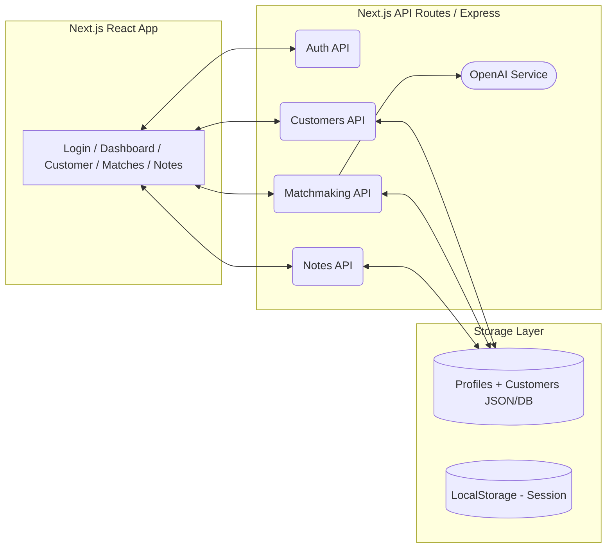

# 💘 TDC MatchMaker
[](https://www.next.jslang.org/)
[](https://www.Node.jslang.org/)
[](https://www.OpenAilang.org/)
[](https://www.TailwindCSSlang.org/)
[](https://www.MockDBlang.org/)
[](https://www.LLMlang.org/)


A production-ready **internal matchmaking tool MVP** built for the TDC team to manage customers, view verified profiles, assign matches, and record notes — powered by an **AI-assisted matching engine**.

## 🌟 Features

### Authentication & Security
- Secure matchmaker login system
- Role-based access control
- Session management

### Customer Management
- Comprehensive customer dashboard with search and filtering
- Real-time statistics and analytics
- Status tracking (Active, Reviewing, Matched, Paused)
- Detailed customer profiles with complete biodata

### AI-Powered Matching
- Gender-specific matching algorithms
- Compatibility scoring with detailed explanations
- Personality and lifestyle analysis
- Automated match ranking and recommendations

### Match Management
- Visual match cards with compatibility breakdowns
- AI-generated personalized introductions
- One-click match sending with email simulation
- Match history and tracking

## 🚀 Live Demo

### Demo Credentials
```
Username: demo
Password: demo123
```

Alternative credentials:
```
Username: sarah.matchmaker
Password: sarah123
```

## 🛠 Tech Stack

### Frontend
- **React 18** with TypeScript for type safety and modern development
- **Tailwind CSS** for responsive design and consistent styling
- **Lucide React** for professional iconography
- **Vite** for fast development and optimized builds

### Matching Algorithm
- Custom compatibility scoring engine
- Gender-specific matching logic
- Multi-factor analysis (age, income, height, values, lifestyle)
- AI-enhanced personality compatibility assessment

### AI Integration
- Intelligent match scoring with explanations
- Automated introduction generation
- Personality and lifestyle compatibility analysis
- Natural language reasoning for profile compatibility

## 📊 Matching Logic

### For Male Customers
The algorithm prioritizes matches based on traditional preferences:
- **Age**: Prefers women who are younger (0-8 years younger optimal)
- **Income**: Favors women with lower income (up to 80% of male's income)
- **Height**: Seeks shorter partners (5-20cm difference ideal)
- **Family Planning**: Strong weight on aligned views about children
- **Location**: Considers relocation flexibility

### For Female Customers
The algorithm focuses on compatibility and stability:
- **Professional Compatibility**: Career level balance and growth potential
- **Financial Stability**: Prefers financially secure partners
- **Values Alignment**: Religion, family values, and life goals
- **Lifestyle Compatibility**: Relocation openness, pet preferences
- **Age Compatibility**: Slight preference for older or same-age partners

### AI Enhancement
The AI layer adds sophisticated analysis:
- **Personality Compatibility**: Education level matching, language compatibility
- **Lifestyle Analysis**: Family structure similarity, work culture alignment
- **Contextual Scoring**: Dynamic adjustments based on profile combinations
- **Explanation Generation**: Natural language reasoning for match recommendations

## 🎯 Key Assumptions

1. **Gender-Specific Preferences**: Implemented traditional Indian matchmaking preferences while maintaining respect and professionalism
2. **Data Privacy**: All customer data is mock/simulated for demonstration purposes
3. **AI Simulation**: Uses rule-based intelligence to simulate AI capabilities (ready for OpenAI API integration)
4. **Scalability**: Designed with modular architecture for easy expansion and real database integration
5. **User Experience**: Prioritized intuitive navigation for busy matchmakers

## 🏗️ Architecture




## 🚀 Getting Started

### Prerequisites
- Node.js 18+ 
- npm or yarn

### Installation

1. Clone the repository:
```bash
git clone <repository-url>
cd tdc-matchmaker-dashboard
```

2. Install dependencies:
```bash
npm install
```

3. Start the development server:
```bash
npm run dev
```

4. Open your browser and navigate to `http://localhost:5173`

### Building for Production

```bash
npm run build
npm run preview
```

## 🔧 Configuration

### Environment Variables
For production deployment with real AI integration:

```env
VITE_OPENAI_API_KEY=your_openai_api_key
VITE_API_BASE_URL=your_backend_api_url
```

### Customization
- **Matching Weights**: Adjust scoring factors in `src/utils/matchingAlgorithm.ts`
- **AI Prompts**: Modify introduction templates in `src/utils/aiService.ts`
- **Design System**: Update color schemes and spacing in `src/index.css`

## 📈 Future Enhancements

### Immediate Roadmap
- Real database integration (PostgreSQL/MongoDB)
- OpenAI API integration for dynamic introductions
- Advanced filtering and sorting options
- Match history and analytics
- Customer notes and interaction tracking

### Advanced Features
- Video call scheduling integration
- Automated follow-up reminders
- Success rate analytics and reporting
- Multi-matchmaker collaboration tools
- Customer feedback and rating system

## 🤝 Contributing

This project follows modern React development practices:
- TypeScript for type safety
- Component-based architecture
- Responsive design principles
- Accessibility considerations
- Performance optimization
